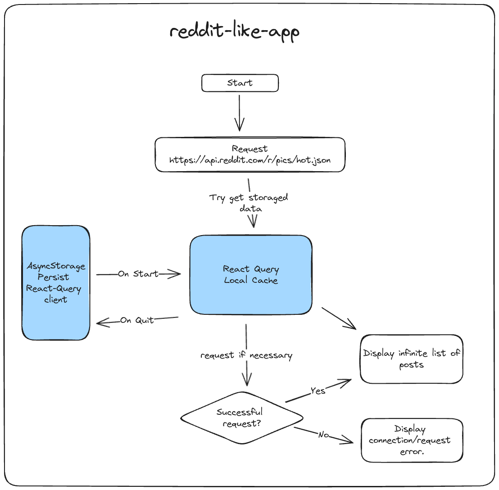

# Reddit-Like-App

This application aims to display a list of posts provided by the Reddit API.

## 🚀 Main Stack

- **React Query:** Handles server-side state and caches data.
- **React Native Async Storage:** Persists the React Query client, enabling recovery of posts data state even if the app is forced to quit.
- **React Navigation:** Manages routing between screens.

## 📈 App Flow Chart



## Installation

1. Clone the repository:

  ```bash
  git clone <repository_url>
  ```

2. Install the dependencies:

  ```bash
  npm install
  ```

## Usage

To run the project, follow these steps:

1. Start the development server:

  ```bash
  npm start
  ```

2. Open the project in the iOS simulator:

  ```bash
  npm run ios
  ```

  or

  Open the project in the Android emulator:

  ```bash
  npm run android
  ```
## License

This project is licensed under the [MIT License](LICENSE).